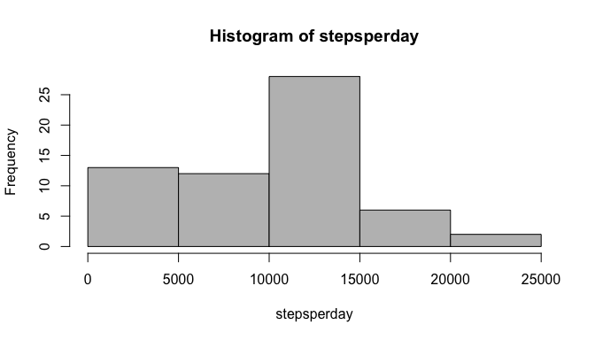
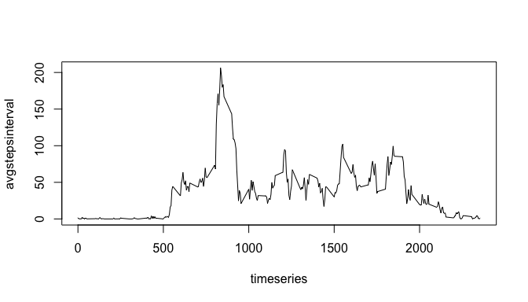
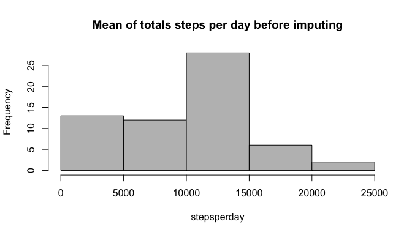
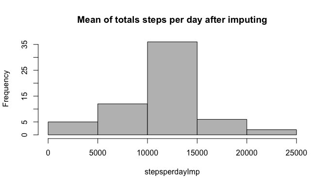
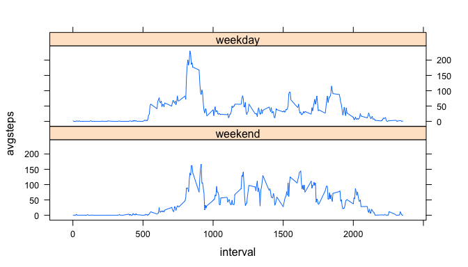

Set up echo through all document

```r
knitr::opts_chunk$set(echo = TRUE)
```

## Loading and preprocessing the data

```r
activity <- read.csv("activity.csv")
# convert to date format
activity$date<-as.Date(strptime(activity$date,"%Y-%m-%d")) 
```

## What is mean total number of steps taken per day?
1. Calculate the total number of steps taken per day  

```r
# calculate total steps per each day
stepsperday<-tapply(activity$steps,activity$date,sum,na.rm = TRUE)
```
2.  Make a **histogram** of the total number of steps taken each day

```r
# plot histogram
hist(stepsperday, col = "grey")
```

<!-- -->

3. Calculate and report the mean and median of the total number of steps taken per day

```r
stepsavg<-round(mean(stepsperday))
stepsmedian <-round(median(stepsperday))
```

mean of the total number of steps taken per day: **9354**  *(rounded)*
median of the total number of steps taken per day: **1.0395\times 10^{4}**  *(rounded)*

## What is the average daily activity pattern?
1. Make a time series plot (i.e.  type = "l") of the 5-minute interval (x-axis) and the average number of steps taken, averaged across all days (y-axis)  

```r
avgstepsinterval <- tapply(activity$steps,activity$interval,mean,na.rm = TRUE)
timeseries <- names(avgstepsinterval)
plot(timeseries,avgstepsinterval, type = "l")
```

<!-- -->

2. Which 5-minute interval, on average across all the days in the dataset, contains the maximum number of steps?

```r
maxsteps<-which.max(avgstepsinterval)
maxtimeseries <- names(avgstepsinterval[maxsteps])
```

Average maximum number of steps: **206.1698113**  
In time series: **835**  

## Imputing missing values  
1. Calculate and report the total number of missing values in the dataset (i.e. the total number of rows with NAs)  


```r
nasteps <-is.na(activity$steps)
sum(nasteps)
```

```
## [1] 2304
```

2. Devise a strategy for filling in all of the missing values in the dataset. The strategy does not need to be sophisticated. For example, you could use the mean/median for that day, or the mean for that 5-minute interval, etc. 

Use mean for that 5-minute interval for filling in all of the missing values in the dataset.

3. Create a new dataset that is equal to the original dataset but with the missing data filled in. 

```r
activityimp<-activity
impvalues<-activity[nasteps,c(1,3)]
impvalues$steps<-avgstepsinterval[as.character(impvalues$interval)]
activityimp[nasteps,1]<-impvalues$steps
```

4. Make a histogram of the total number of steps taken each day  

```r
stepsperdayImp<-tapply(activityimp$steps,activityimp$date,sum,na.rm = TRUE)
hist(stepsperday, col = "grey", main = "Mean of totals steps per day before imputing")
```

<!-- -->

```r
hist(stepsperdayImp, col = "grey", main = "Mean of totals steps per day after imputing")
```

<!-- -->

4.1. Calculate and report the mean and median total number of steps taken per day.    

```r
stepsavgImp<-round(mean(stepsperdayImp))
stepsmedianImp <-round(median(stepsperdayImp))
stepsavgImp
```

```
## [1] 10766
```

```r
stepsmedianImp
```

```
## [1] 10766
```

4.2  Do these values differ from the estimates from the first part of the assignment? What is the impact of imputing missing data on the estimates of the total daily number of steps?


```r
# Before imputing
summary(stepsperday)
```

```
##    Min. 1st Qu.  Median    Mean 3rd Qu.    Max. 
##       0    6778   10395    9354   12811   21194
```

```r
# After imputing
summary(stepsperdayImp)
```

```
##    Min. 1st Qu.  Median    Mean 3rd Qu.    Max. 
##      41    9819   10766   10766   12811   21194
```

 
## Are there differences in activity patterns between weekdays and weekends?
1. Create a new factor variable in the dataset with two levels -- "weekday" and "weekend" indicating whether a given date is a weekday or weekend day.

```r
wday <- c('Monday', 'Tuesday', 'Wednesday', 'Thursday', 'Friday')
activityimp$daytype <- factor((weekdays(activityimp$date) %in% wday), levels=c(FALSE, TRUE), labels=c('weekend','weekday'))
```

2. Make a panel plot containing a time series plot (i.e. type = "l") of the 5-minute interval (x-axis) and the average number of steps taken, averaged across all weekday days or weekend days (y-axis). 

```r
library("dplyr")
```

```
## 
## Attaching package: 'dplyr'
```

```
## The following objects are masked from 'package:stats':
## 
##     filter, lag
```

```
## The following objects are masked from 'package:base':
## 
##     intersect, setdiff, setequal, union
```

```r
groupped <- group_by_at(activityimp, vars(daytype,interval))
stepsperdtype <- summarise(groupped,avgsteps = mean(steps))
library("lattice")
xyplot(avgsteps ~ interval | daytype, data = stepsperdtype, layout = c(1, 2), type = "l")
```

<!-- -->
